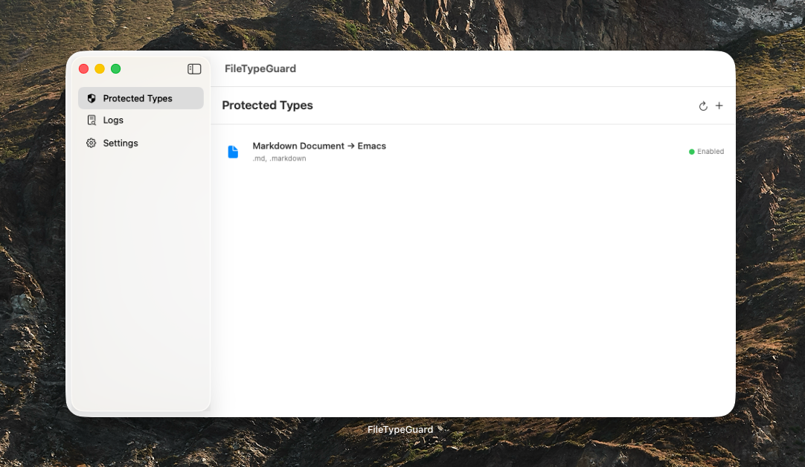

# FileTypeGuard

**Your files, always opening your way.**

A lightweight macOS utility that locks your file type associations and automatically restores them when third-party apps change them without your permission.



## The Problem

Many apps silently hijack your default file associations during installation or updates. You set Preview as your PDF reader, then one day Adobe Acrobat takes over. You fix it, and it happens again. FileTypeGuard puts an end to this.

## How It Works

1. **Lock** — Tell FileTypeGuard which app should open each file type
2. **Monitor** — It watches for changes to your file associations in real time
3. **Restore** — When a change is detected, it instantly reverts to your preference
4. **Notify** — You get a system notification about what happened

## Features

- **File type protection** — Lock any file extension to your preferred app
- **Auto-restore** — Detects and reverts unauthorized changes within seconds
- **Real-time monitoring** — Watches the Launch Services database + polling fallback
- **Event logging** — Full history of all changes and restorations
- **System notifications** — Get notified when associations are restored (with throttling)
- **Visual file type picker** — Browse common file types by category or enter custom extensions
- **Localized** — English, Japanese, Simplified Chinese, Traditional Chinese
- **Zero dependencies** — Pure Swift + SwiftUI, no third-party libraries

## Requirements

- macOS 13.0 (Ventura) or later
- Xcode 15.0+ (for building)

## Build

### With Xcode

```bash
git clone https://github.com/user/FileTypeGuard.git
cd FileTypeGuard
xcodegen generate
open FileTypeGuard.xcodeproj
```

Then build and run from Xcode (Cmd+R).

### With Swift Package Manager

```bash
swift build
swift run FileTypeGuard
```

## Usage

1. **Add a protection rule** — Go to the "Protected Types" tab, click +, select a file type and your preferred app
2. **View logs** — The "Logs" tab shows all detected changes and restoration results
3. **Configure** — The "Settings" tab lets you adjust monitoring interval, notifications, auto-recovery, and more

## Architecture

```
FileTypeGuard/
├── App/                          # App entry point, coordinator
├── Core/
│   ├── Configuration/            # JSON-based config persistence
│   ├── LaunchServices/           # macOS Launch Services API wrapper
│   ├── Logging/                  # Event logging and querying
│   ├── Monitor/                  # File association change detection
│   ├── Notification/             # System notification delivery
│   └── Protection/               # Detection, recovery, retry logic
├── Features/
│   ├── Main/                     # Navigation split view
│   ├── ProtectedTypes/           # Rule list, file type picker, app picker
│   ├── Logs/                     # Log viewer with search and filters
│   └── Settings/                 # Preferences UI
├── Models/                       # Data models (FileType, ProtectionRule, LogEntry, etc.)
└── Resources/
    ├── Localizable.xcstrings     # String catalog (en, ja, zh-Hans, zh-Hant)
    └── Assets.xcassets/          # App icon
```

**Stack:** Swift 5.9 · SwiftUI · MVVM · macOS 13+

## Note

This app requires the App Sandbox to be disabled in order to access the Launch Services API. It is not suitable for Mac App Store distribution. Distribute via GitHub Releases or DMG.

## License

MIT

## Contributing

Issues and pull requests are welcome.
